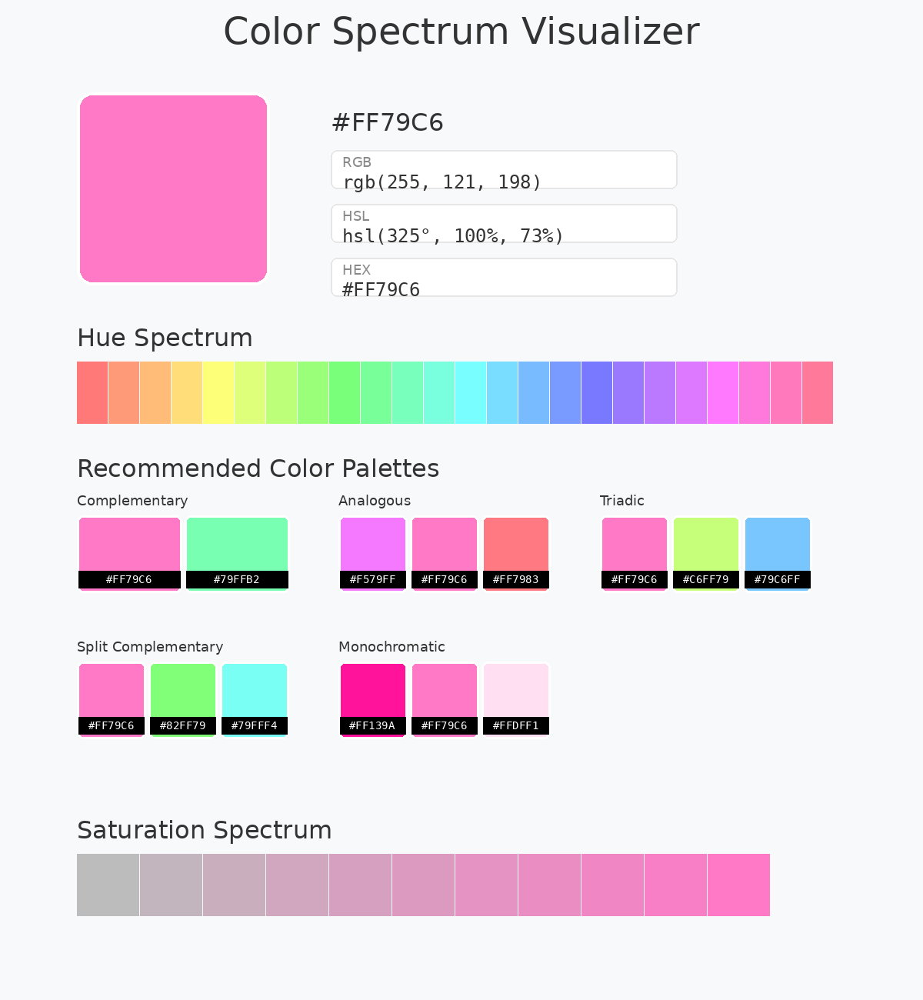

# 🎨 Color Visualizer

A beautiful color visualization tool that generates professional color spectrum images with palettes, hue spectrums, and saturation gradients.

> **Cross-platform:** Works on macOS, Windows, and Linux
> **Packaged app:** Double-click to run on macOS (no terminal needed!)



---

## ✨ Features

| Feature | Description |
|---------|-------------|
| **🎨 Multi-Format Support** | HEX, RGB, CMYK, HSL, HSB/HSV - enter colors in any format |
| **🌈 Visual Spectrum** | Full hue spectrum with 24 color gradations |
| **🎯 Color Palettes** | Complementary, Analogous, Triadic, Split Complementary, Monochromatic |
| **📊 Saturation Spectrum** | 11-step saturation gradient |
| **💻 GUI & CLI** | Simple dialog interface or command-line mode |
| **🖥️ Cross-Platform** | macOS (native .app), Windows, Linux |
| **📦 Packaged App** | One-click execution (no Python required for end users) |

---

## 🚀 Quick Start

### macOS Users (Recommended)

**Use the pre-built app:**

1. Open `dist/Color Visualizer.app`
2. Enter a color in the dialog (e.g., `#ffb6c1`)
3. Click "Visualize"
4. The spectrum image opens automatically!

**Install to Applications:**
```bash
cp -r "dist/Color Visualizer.app" /Applications/
```

### All Platforms - Python Script

```bash
# GUI Mode (default)
python3 color_visualizer_crossplatform.py

# Command-line with color
python3 color_visualizer_crossplatform.py "#ffb6c1"

# Save to specific file
python3 color_visualizer_crossplatform.py "#ffb6c1" output.png

# Interactive CLI
python3 color_visualizer_crossplatform.py --cli
```

---

## 📦 Installation & Requirements

### For Packaged App (macOS)

**No installation needed!** Just run `Color Visualizer.app`

### For Python Script

**Requirements:**
- Python 3.7+
- Pillow (PIL)
- Tkinter (for GUI mode)

**Install dependencies:**
```bash
# macOS
brew install python-tk@3.14  # If not already installed
pip3 install pillow

# Windows
pip install pillow

# Linux (Ubuntu/Debian)
sudo apt-get install python3-tk
pip3 install pillow
```

---

## 🎨 Supported Color Formats

| Format | Examples | Description |
|--------|----------|-------------|
| **HEX** | `#ffb6c1`, `ffb6c1`, `#abc` | Hexadecimal (3 or 6 digits) |
| **RGB** | `rgb(255, 182, 193)`, `255,182,193` | Red, Green, Blue (0-255) |
| **CMYK** | `cmyk(0, 29, 24, 0)` | Cyan, Magenta, Yellow, Key (0-100%) |
| **HSL** | `hsl(351, 100, 86)` | Hue (0-360°), Saturation, Lightness (0-100%) |
| **HSB/HSV** | `hsb(351, 29, 100)` | Hue, Saturation, Brightness/Value |

---

## 📊 Generated Output

The visualizer creates a **1200×1300px PNG** image including:

### Components

1. **Title** - "Color Spectrum Visualizer"
2. **Main Color Swatch** - 250×250px rounded square
3. **Color Information**
   - RGB values
   - HSL values
   - HEX code
4. **Hue Spectrum** - 24-color gradient showing full hue range
5. **Recommended Color Palettes** (with hex codes)
   - Complementary (2 colors)
   - Analogous (3 colors)
   - Triadic (3 colors)
   - Split Complementary (3 colors)
   - Monochromatic (3 colors)
6. **Saturation Spectrum** - 11-step gradient from 0% to 100%

**Output location:** `/tmp/color_spectrum.png` (auto-opens in default image viewer)

---

## 🔧 Building the App

### macOS

Already built! The `.app` is in the `dist/` folder.

**To rebuild:**
```bash
pip3 install pyinstaller
pyinstaller --name="Color Visualizer" --windowed --icon=thumbnail-icon.png --add-data="thumbnail-icon.png:." --noconfirm color_visualizer_crossplatform.py
```

### Windows

```bash
pip install pyinstaller
pyinstaller --name="Color Visualizer" --windowed --icon=thumbnail-icon.png --noconfirm color_visualizer_crossplatform.py
```

Creates: `dist/Color Visualizer.exe`

### Linux

```bash
pip3 install pyinstaller
pyinstaller --name="Color Visualizer" --windowed --noconfirm color_visualizer_crossplatform.py
```

Creates: `dist/Color Visualizer` (binary)

---

## 📁 Project Structure

```
color-visualizer/
├── color_visualizer_crossplatform.py  # Main application (cross-platform)
├── thumbnail-icon.png                 # App icon
├── test_spectrum.png                  # Example output
├── setup.py                           # py2app configuration (legacy)
├── .gitignore                         # Git ignore rules
├── README.md                          # This file
│
├── dist/
│   └── Color Visualizer.app           # macOS packaged application
│
└── ex/                                # Example implementations
    ├── generate_color_image.py        # Standalone image generator
    ├── generate_color_spectrum.py     # Simple spectrum generator
    ├── generate_interactive_spectrum.py # HTML interactive version
    └── ColorVisualizer.applescript    # Original AppleScript version
```

---

## 🖥️ Platform-Specific Features

### macOS
- ✅ **Native dialogs** using AppleScript for reliability
- ✅ **Packaged .app** for easy distribution
- ✅ **App icon** with thumbnail-icon.png
- ✅ **Auto-opens** in Preview.app

### Windows
- ✅ **Tkinter dialogs** for user input
- ✅ **Can be packaged** as .exe with PyInstaller
- ✅ **Auto-opens** with default image viewer

### Linux
- ✅ **Tkinter dialogs** for user input
- ✅ **Can be packaged** as binary with PyInstaller
- ✅ **Auto-opens** with `xdg-open`

---

## 🛠️ Troubleshooting

### macOS: "App can't be opened"

```bash
# Remove quarantine attribute
xattr -cr "dist/Color Visualizer.app"
```

### macOS: "Tkinter not available"

```bash
brew install python-tk@3.14
```

### Windows/Linux: "Pillow not found"

```bash
pip install pillow
# or
pip3 install pillow --user
```

### Dialog doesn't appear

**macOS:** The app uses native AppleScript dialogs - ensure no other apps are blocking them.
**Windows/Linux:** Tkinter dialogs should appear automatically. Check if Python has GUI permissions.

### Fonts look different

The script auto-detects system fonts:
- **macOS:** Helvetica, Courier
- **Windows:** Arial, Courier New
- **Linux:** DejaVu Sans, DejaVu Sans Mono

---

## 🎯 Use Cases

- **Design work** - Quickly explore color variations and palettes
- **Development** - Generate color schemes for UI/UX projects
- **Education** - Learn about color theory and HSL/RGB/CMYK conversions
- **Documentation** - Create color reference images for style guides

---

## 📝 Examples

### Example 1: Pink Color
```bash
python3 color_visualizer_crossplatform.py "#ffb6c1"
```
Generates a spectrum showing pink variations and complementary colors.

### Example 2: Blue from RGB
```bash
python3 color_visualizer_crossplatform.py "rgb(100, 149, 237)"
```
Generates a spectrum for Cornflower Blue.

### Example 3: Custom Output Path
```bash
python3 color_visualizer_crossplatform.py "#ff6347" ~/Desktop/tomato_spectrum.png
```
Saves the Tomato color spectrum to Desktop.

---

## 🔄 Migration from AppleScript

This Python version maintains the same workflow as the original AppleScript:

| AppleScript | Python Equivalent |
|-------------|-------------------|
| `display dialog` | Native AppleScript (macOS) / Tkinter (Win/Linux) |
| `do shell script` | `subprocess.run()` |
| `open -a Preview` | `open` (macOS) / `start` (Win) / `xdg-open` (Linux) |
| `.app bundle` | PyInstaller packaging |

**Benefits of Python version:**
- ✅ Cross-platform (not macOS-only)
- ✅ Can be packaged for all OSes
- ✅ CLI mode available
- ✅ Same visual output
- ✅ More flexible color format support

---

## 📜 License

MIT License - Free to use, modify, and distribute.

---

## 🙏 Credits

- Color theory algorithms based on standard HSL/RGB/CMYK conversions
- Image generation powered by [Pillow](https://pillow.readthedocs.io/)
- macOS packaging with [PyInstaller](https://pyinstaller.org/)
- Original AppleScript concept

---

## 📧 Support

If you encounter any issues or have suggestions:
1. Check the Troubleshooting section above
2. Ensure all dependencies are installed
3. Try running from command line to see error messages
4. For macOS app issues, try running the Python script directly

---

**Enjoy creating beautiful color visualizations! 🎨✨**
